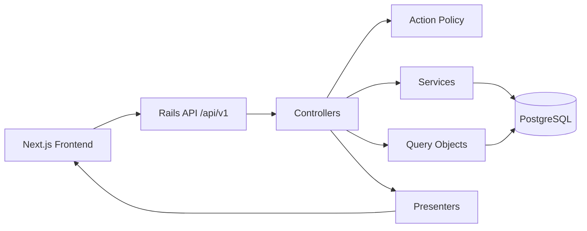
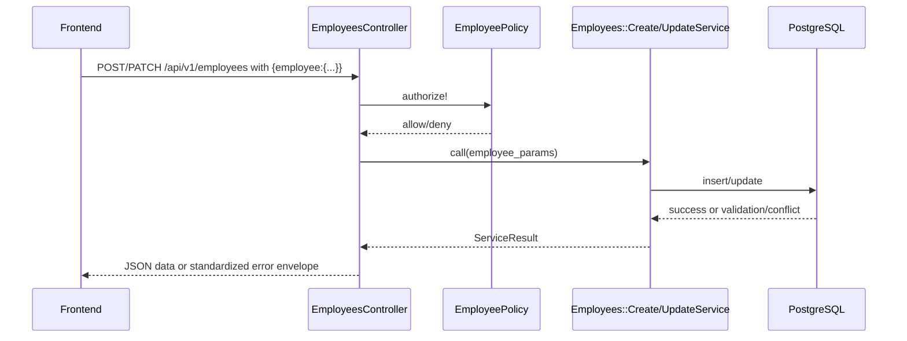

# Architecture Notes

## System Overview

The project is a monorepo with two apps:

- `backend/`: Rails 8 JSON API
- `frontend/`: Next.js 16 UI

The backend is designed as an API first service for an HR Manager persona to manage employee records and generate salary insights.

## Major Architecture Decisions

### 1) Layered Rails API (Controller -> Service/Query -> Model -> Presenter)

What I chose:

- Thin controllers for request orchestration and response rendering.
- Services for write/business workflows (`Employees::CreateService`, `Employees::UpdateService`, `Employees::DestroyService`).
- Query objects for read-heavy and aggregate behavior (`Employees::FilterQuery`, `Insights::*Query`).
- Presenters for stable JSON shape (`Api::V1::EmployeePresenter`).

Why:

- Keeps responsibilities explicit and testable.
- Localizes change when behavior evolves.
- Improves readability and maintainability.

Tradeoff:

- More files and indirection than putting all logic in controllers/models.
- But this tradeoff will pay off once we have a larger codebase.

### 2) Soft Delete for Employees

What I chose:

- Soft delete via `deleted_at`.
- Read paths use `Employee.not_deleted`.

Why:

- Prevents accidental hard data loss.
- Preserves historical data for HR workflows.

Tradeoff:

- Every read/query must consistently exclude deleted rows.
- We could use default scope, but I dont really find that good practice as it's less explicit.

### 3) API Auth with JWT + Refresh Token Rotation

What I chose:

- Devise + devise-jwt for access tokens.
- Stateful refresh tokens in DB with rotation/revocation.

### 4) Role-Based Authorization with Action Policy

What we chose:

- `EmployeePolicy` guards employee and insight endpoints.
- In-scope allowed role: `hr_manager`.

Why:

- Centralized, explicit authorization rules.
- Easy extension for future roles.

Tradeoff:

- Policy wiring and tests must evolve with each endpoint.
- For now we only have `hr_manager` role so this does not add more advantage. but once we have more roles and permissions, this will be a big win.

## Error Contract Decision

Standardized error envelope across endpoints:

- `error.code`
- `error.message`
- `error.details`
- `error.request_id`

Why:

- Consistent frontend handling and easier debugging.

Tradeoff:

- Requires strict consistency across all controllers and tests.

## Testing and Quality Strategy

- Request specs for auth/authz and API contracts.
- Model specs for validations and soft delete behavior.
- Query specs for filtering/search/sorting determinism.
- Security and quality checks with Brakeman + RuboCop.

Tradeoff:

- More tests increase runtime, but significantly improve refactor safety.

## Architecture Diagrams

### Logical Component Flow

### Employee Create/Update Request Flow

## Key Tradeoffs Summary

- Layered architecture improves maintainability but increases indirection.
- Soft delete improves safety but requires query discipline.
- SQL-first insights improve performance but tie implementation to PostgreSQL behavior.

## Future Improvements

- Add salary change history/audit trail.
- Add OpenAPI schema for stronger API contract visibility.
- Add benchmark artifacts for p95 endpoint latency with seeded 10k data.
- Add caching strategy if insight endpoints become high-traffic.
